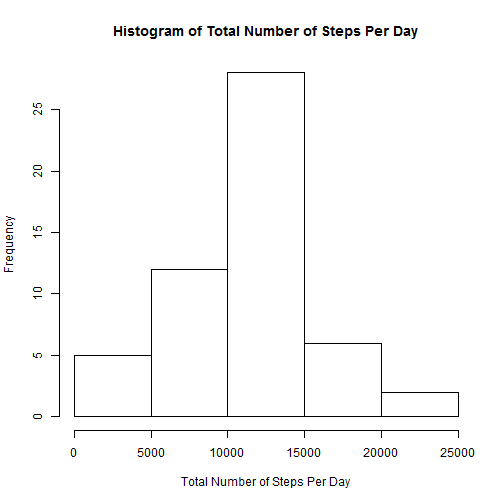
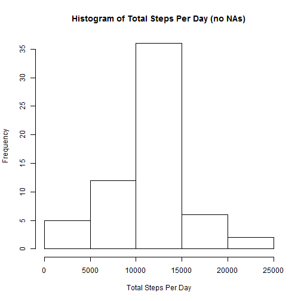

## Loading and preprocessing the data

```r
activity<-read.csv("activity.csv", header = TRUE)  
```

## What is mean total number of steps taken per day?

```r
daytotal<-tapply(activity[,1],activity[,2],sum)  
hist(daytotal,main="Histogram of Total Number of Steps Per Day"
     ,xlab="Total Number of Steps Per Day")
```

 

The mean value of daily total is 

```r
mean(daytotal,na.rm=T)
```

```
## [1] 10766.19
```
The median value of daily total is

```r
median(daytotal,na.rm=T)  
```

```
## [1] 10765
```

## What is the average daily activity pattern?

```r
avgsteps<-tapply(activity[,1],activity[,3],mean,na.rm=T)
plot(activity[1:288,3],avgsteps,type="l",main=" Average Daily Activity"
     ,xlab="Interval",ylab="Average Steps")
```

 
The following 5-minute interval, on average across all the days in the dataset, contains the maximum number of steps:

```r
activity[which.max(avgsteps),3]
```

```
## [1] 835
```
## Imputing missing values
The total number of missing values in the dataset (i.e. the total number of rows with  NA s)

```r
narow<-is.na(activity)
sum(narow)
```

```
## [1] 2304
```
My strategy for filling the missing values is to use replace the NAs with the mean value for that interval.  

```r
activitynona<-activity
index<-which(is.na(activity[,1]))
avgstepinterval<-cbind(activity[1:288,3],avgsteps)
for(i in seq_along(index)) {
  selindex<-which(avgstepinterval[,1]==activity[index[i],3])
  activitynona[index[i],1]<-avgstepinterval[selindex,2]
  }
```
The dataset with the replaced NAs is called "activitynona"
I have calculated and plotted the histogram of the total activty for the new dataset


```r
daytotal2<-tapply(activitynona[,1],activitynona[,2],sum)
hist(daytotal2, main="Histogram of Total Steps Per Day (no NAs)"
     , xlab="Total Steps Per Day")
```

 
The mean of the new dataset does not change because the NAs have been replaced with the mean for the interval.

```r
mean(daytotal2,na.rm=T)
```

```
## [1] 10766.19
```
The median value increases slightly because 2304 NAs are now replaced by the mean value.

```r
median(daytotal2,na.rm=T)
```

```
## [1] 10766.19
```

## Are there differences in activity patterns between weekdays and weekends?
To create a new factor variable donating weekday/weekend, I first add a column to the activitynona file that indicates the day of the week ("mon","tue", etc). I add another column that assigns a value of "weekend" or "weekday" depending on the day of the week. I also calculate the average steps for each period for weekday and weekend using "tapply"

```r
dayofweek<-weekdays(as.Date(activitynona[,2]),abbreviate=T)
activitynona<-cbind(activitynona,dayofweek)
daytype<-rep("weekday",17568)
daytype[which(activitynona[,4]=="Sat")]<-"weekend"
daytype[which(activitynona[,4]=="Sun")]<-"weekend"
activitynona<-cbind(activitynona,daytype)
avgdaysteps<-tapply(activitynona[,1],activitynona[,c(3,5)],mean,na.rm=T)
```
The panel plot of avg steps shows the difference in activity on weekdays and weekend. The weekend shows much higher through the daytime while the weeday shows a spike in activity in the morning around 8:30 am.

```r
intervalp<-c(activity[1:288,3],activity[1:288,3])
stepavg<-c(avgdaysteps[,1],avgdaysteps[,2])
library(lattice)
weekdayfac<-rep("weekday",288);weekendfac<-rep("weekend",288)
daytypefactor<-c(weekdayfac,weekendfac)
f<-factor(daytypefactor,labels=c("weekday","weekend"))
xyplot(stepavg ~ intervalp | f, layout = c(1, 2),type="l"
       ,main=" Difference in Activity Pattern",xlab="Interval"
       ,ylab="Number of steps")
```

 
